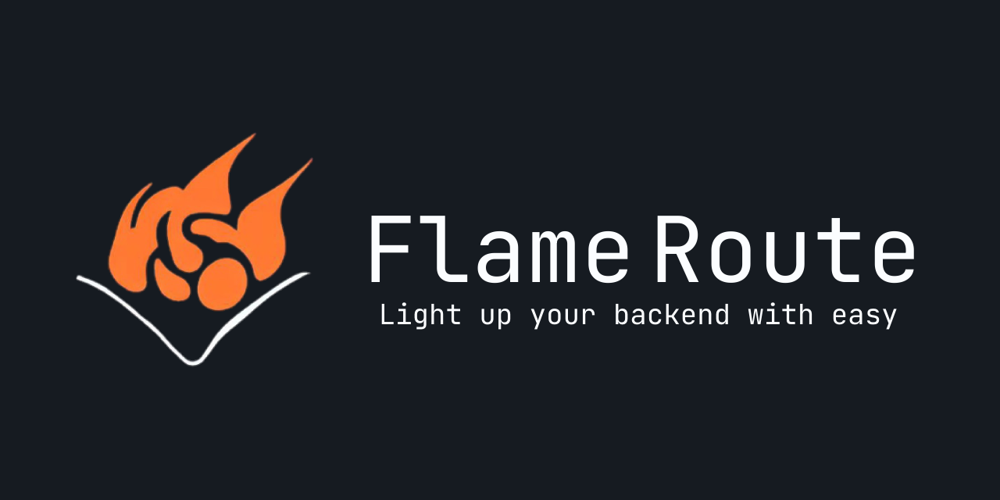

# [](https://github.com/SunPodder/Flame-Route#readme)

<div align="center">

[](https://github.com/SunPodder/Flame-Route/actions)
[](https://cmake.org/)
[](https://opensource.org/licenses/GPL-3.0)

</div>

## Overview

Flame-Route is a lightweight C++ framework for building HTTP-based backends with ease. It provides an easy-to-use API for defining routes and handling HTTP requests, while allowing for flexible customization and extensibility.

## Installation

Flame-Route uses CMake as the build system. To build from source, clone the repository and run the following commands:

```bash
mkdir build
cd build
cmake ..
make
make install
```
This will build an example server and all parts of the framework, which can be installed and used in your own projects.

## Usage

To use Flame-Route in your project, include the appropriate headers and link against the Flame-Route library:
```cxx
#include <FlameRoute/http/method.hpp>
#include <FlameRoute/http/request.hpp>
#include <FlameRoute/http/response.hpp>
#include <FlameRoute/http/server.hpp>

void home(const HTTPRequest &request, HTTPResponse &response){
    response.body = "<h1>Welcome to Home</h1>";
}

int main(){
    FlameServer *server = new FlameServer();

    server->register_static_route("/static", "./static");

    server->register_route("/", {GET}, home);

    server->ignite("127.0.0.1", 8080);
    delete server;
    return 0;
}
```
For more detailed usage instructions, check out the [documentation](https://sunpodder.github.io/Flame-Route).

## Contributing

Contributions to Flame-Route are welcome! If you encounter a bug or have a feature request, please open an issue. If you would like to contribute code, please fork the repository and open a pull request. Also, see our [Contributing Guidelines](./CONTRIBUTING.md).

## License

Flame-Route is licensed under the [GPL-3.0 License](./LICENSE).
